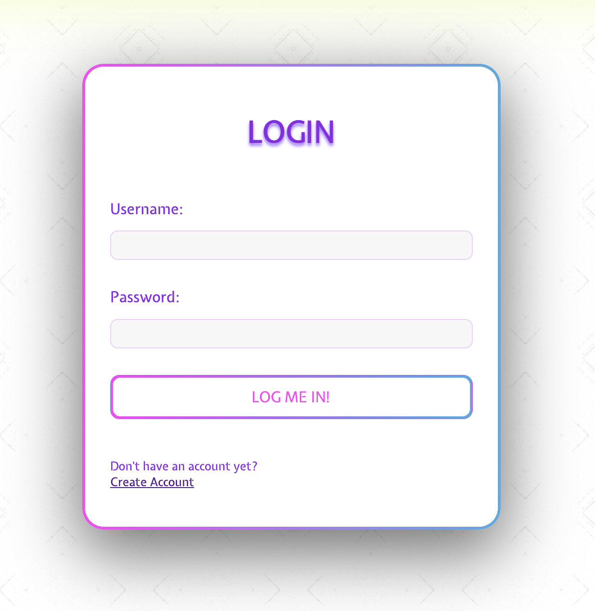

# Welcome to Project-42! 🎮

## E-commerce project where users can add and trade in-game currency/items etc.

#### ------> Actively under development! <------

### Tech stack: 

👾 Frontend: React.js |
🎯 Backend: Express.js |
♥️ Database: MongoDB |

-------------------------------------------------------------------------

### Registering user:

User input is advised by prompts.
Once all the conditions are satisfied, the 'Register' button is activated.

-------------------------------------------------------------------------

### User login:

The login form changes border colour to red and wiggles if user entered wrong information.

-------------------------------------------------------------------------

### Add item:

Process of adding the item.

-------------------------------------------------------------------------

### My items:

Place where users can see, edit and delete their items.

-------------------------------------------------------------------------
