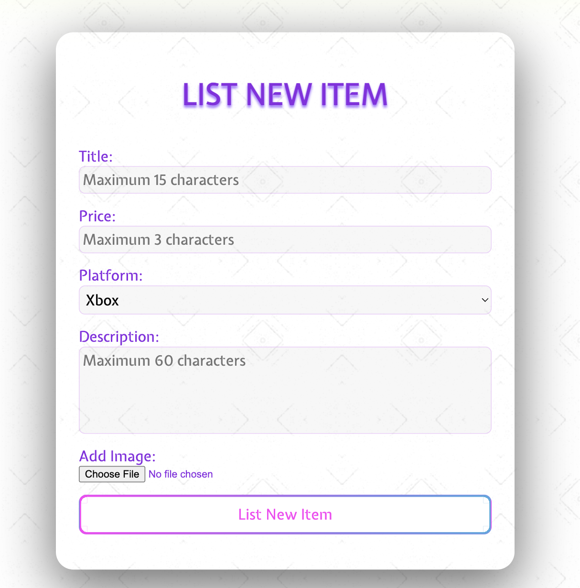

# Welcome to Project-42! 🎮

## E-commerce project where users can add and trade in-game currency/items etc.

#### ------> Actively under development! <------

### Tech stack: 

👾 Frontend: React.js |
🎯 Backend: Express.js |
♥️ Database: MongoDB |

-------------------------------------------------------------------------

### Registering user:

User input is advised by prompts.
Once all the conditions are satisfied, the 'Register' button is activated.

-------------------------------------------------------------------------

### Browse all items:

The page where we browse items from all users and add selected items to our cart. We receive the number of cart items on the icon in the top right corner. 

-------------------------------------------------------------------------

### My Cabinet:

Place where we see our own items, user can edit the item ino as well as delete items.

-------------------------------------------------------------------------
### Editing user profile:

We can update our profile by clicking on "Edit Profile" button under the profile picture.

-------------------------------------------------------------------------

### Add item:

Process of adding the item.

-------------------------------------------------------------------------
### Cart:

This is where cart items are stored before user jumps to checkout.

-------------------------------------------------------------------------

### My wallet:

Place where users add new credit cards and see the added ones.

-------------------------------------------------------------------------
### My items:

Place where users can see, edit and delete their items.

-------------------------------------------------------------------------
